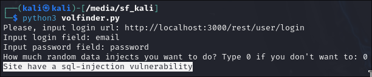
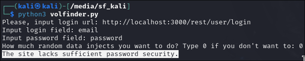
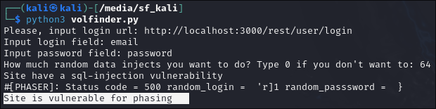

# Дипломная работа

Это отчет по дипломной работе от курса skillfactory.

* **Тема: Метод поиска и устранения уязвимостей в открытом программном обеспечении для финансовой сферы**
* **Задача: написать скрипт на питоне, который будет находить минимум 3 типовые уязвимости в open-source программном обеспечении**

Для начала нам надо разобраться в некоторой терминологии, а так же какие уязвимости существуют у подобного ПО и какие именно будет находить скрипт.

### Что такое open-source ПО?

Это программное обеспечение с открытым исходным кодом, доступным любому желающему пользователю в интернет сети.

## Типовые уязвимости

Как и любое другое - финансовое по имеет следующие типовые уязвимости:

* SQL-инъекция
* Недостаточные требования к сложности пароля
* Небезопасная обработка данных
* Межсайтовая подделка запросов (CSRF)
* Межсайтовы скриптинг (XSS)
* Использование устаревших и/или уязвимых библиотек и зависимостей

Моя программа будет находить **первые три**.

## Принцип работы программы

Обязательные параметры, которые требуются от пользователя - ссылка на страницу аутентификации, а так же имена ключей логина и пароля. На любом (без дополнительных и/или особых методов шифрования) сайте аутентификация проходит путём подачи POST запроса на сайт. Его тело состоит из таких ключей:

> [имя_ключа_логина]: [логин пользователя]
> [имя_ключа_пароля]: [пароль пользователя]

Однако, имена ключей могут отличаться от сайта к сайту (ровно как и ссылка на страницу аутентификации), и нет унифицированного метода поиска этих имён (а если и есть, то на его написание уйдёт слишком много усилий). По сему пользователь должен ввести эти параметры вручную.

**Принцип работы программы** базируется на передаче определённых данных серверу и обрабатыванию кода ответа этого самого сервера. 

## Демонстрация

В качестве заведомо уязвимого по с открытым програмным кодом - мы будем использовать [juice-shop](https://github.com/juice-shop/juice-shop). Не будем разбирать код программы, так как он полон комментариев, так что надеюсь вы и без моего объяснения всё поймёте.

### SQL-инъекция

Программа сравнивает код ответа в случае заведомого неверного логина и пароля, а затем код ответа в случае использования SQL инъекции. Если они отличаются, то приложение уязвимо к SQL инъекциям. И даже если код ответа в случае SQL инъекции не будет успешным, но будет отличаться от обычного введения неверного логина и пароля, то это тоже считается уязвимостью, поскольку если поведение программы меняется при SQL инъекции, то её взлом это вопрос времени.

### Слабый пароль

Программа пробует заведомо неправильный пароль, однако если на сайте присутствуют недостоаточные требования к сложности пароля, то изначальные имя пользователя и пароль могут подойти, и тогда программа найдёт уязвимость пароля.

### Фазинг

В программе я реализовал простой фазер, который делает передачу случайных данных на сайт. Затем сравнивает коды ответа на каждой итерации фазера с изначальным ответом серевера, и если коды не совпадают, значит поведение программы меняется, хотя данные всё ещё остаются неверными. Именно по этому в данном случае чувствивтельность программы к фазингу можно назвать как уязвимость.

## Заключение

Весь код программы загружен находится в файле `vulnfinder.py`. Программа находит 3 типовых уязвимости в финансовом ПО и не только.
